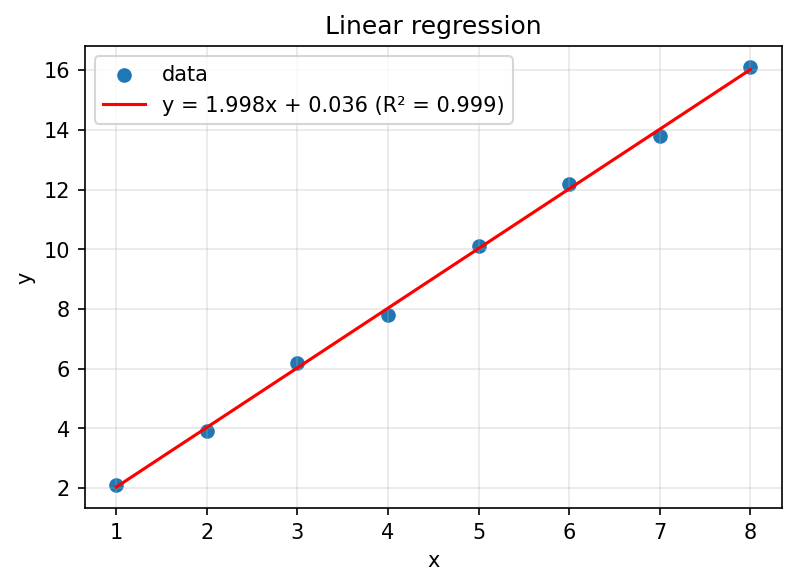

# sci-data-tool

[](https://github.com/Arnur0420/sci-data-tool/actions/workflows/ci.yml)


A small Python tool for processing and visualizing experimental data.
It loads a CSV file, cleans it, computes descriptive statistics, fits a
linear regression and saves plots.



## Features

- Loading CSV files and cleaning data (duplicates and missing values)
- Descriptive statistics: count, mean, standard deviation, min, max
- Least-squares linear regression with the coefficient of determination R²
- Scatter plot with the regression line and a histogram saved as images
- Command-line interface
- Automated tests and CI/CD with GitHub Actions

## Technology choices

| Technology | Why it was chosen |
|---|---|
| Python | The de facto standard language in science, readable, large ecosystem |
| NumPy | Fast array operations and least-squares fitting (`polyfit`) |
| pandas | Convenient CSV reading and data cleaning |
| Matplotlib | The standard library for publication-quality plots |
| argparse | Command-line parsing from the standard library, no extra dependency |
| pytest, pytest-cov | Short readable tests, fixtures (`tmp_path`), coverage reports |
| flake8 | Automatic code style checks (PEP 8) |
| Git + GitHub | Version control, issues, pull requests |
| GitHub Actions | CI/CD built into GitHub, free for public repositories |

## Installation

```bash
git clone https://github.com/Arnur0420/sci-data-tool.git
cd sci-data-tool
python -m venv venv
venv\Scripts\activate        # Windows
# source venv/bin/activate   # Linux / macOS
pip install -r requirements.txt
```

Python 3.10 or newer is recommended.

## Usage

```bash
python -m sci_tool data/sample.csv
```

Options:

| Option | Default | Description |
|---|---|---|
| `csv_path` | required | Path to the input CSV file |
| `--x` | `x` | Name of the x column |
| `--y` | `y` | Name of the y column |
| `--output` | `output` | Directory for saved plots |
| `--bins` | `10` | Number of histogram bins |

The program prints the statistics and regression parameters and saves
`regression.png` and `histogram.png` to the output directory.

Use as a library:

```python
from sci_tool.loader import load_csv, clean_data
from sci_tool.stats import describe, linear_regression

df = clean_data(load_csv("data/sample.csv"))
print(describe(df["y"]))
print(linear_regression(df["x"], df["y"]))
```

## Project structure

```
sci-data-tool/
├── sci_tool/            # package source code
│   ├── loader.py        # CSV loading and cleaning
│   ├── stats.py         # statistics and regression
│   ├── plots.py         # plotting
│   └── cli.py           # command-line interface
├── tests/               # pytest tests
├── data/sample.csv      # example data
├── docs/                # images for the documentation
├── .github/workflows/   # CI/CD configuration
├── pyproject.toml       # package metadata and build configuration
└── requirements.txt
```

## Testing

```bash
pytest --cov=sci_tool
flake8
```

## CI/CD

The workflow in [`.github/workflows/ci.yml`](.github/workflows/ci.yml)
runs on every push and pull request to `main`:

1. **Lint and test** on Python 3.10, 3.11 and 3.12: `flake8`, then `pytest` with a coverage report (uploaded as an artifact).
2. **Build package**: creates a wheel and a source distribution (`python -m build`) and uploads them as the `dist` artifact.

## Development workflow

Every change goes through an issue, a feature branch and a pull request
(`feature/loader`, `feature/stats`, `feature/plots`, `feature/cli`,
`feature/ci`, `docs/readme`). A pull request is merged only after the CI checks pass.

## License

Released under the [MIT License](LICENSE).